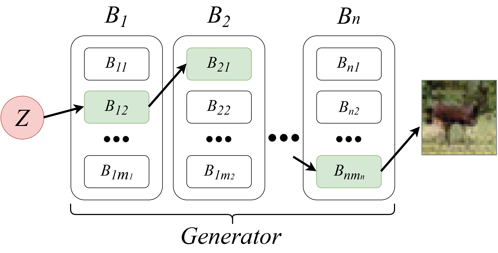
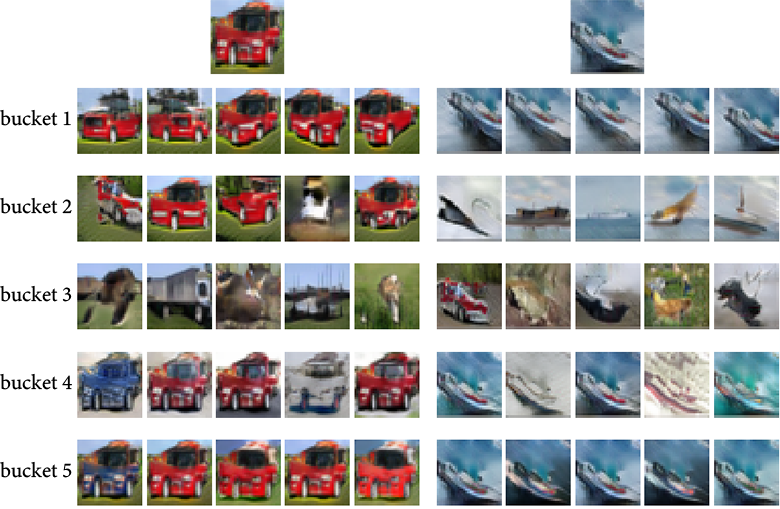

# Random Path GAN (RPGAN)

Original pytorch implementation of anonymous ICLR2020 submission _RPGAN: random paths as a latent space for GAN interpretability_.

RPGAN is an alternative GAN design based on random routes in generator, which can serve as a tool for generative models interpretability.


# How to run?

Go to ```./lib```.
Run train:

```python train.py --out <out_directory> --model sn_resnet32 --data cifar10 --data_path <path_to_dataset>```

FID computation:

```python score/scoring.py --dir <train_out_directory>```

# How to visualize?

Once you have a RPGAN generator and ```.json``` with its parameters, run

```python visualization.py --model_params <path_to_params.json> --model <path_to_model.pt> --out_dir <out_directory>```

This script generates images charts with layers variations.



Pretrained models location:
https://drive.google.com/drive/folders/1hn6nk7eM4gv4HU0PXmrhGjD-y1GoDCyz?usp=sharing

# License
Code for FID computation is based on
https://github.com/mseitzer/pytorch-fid

Code for Spectral Norm module is based on
https://github.com/christiancosgrove/pytorch-spectral-normalization-gan
